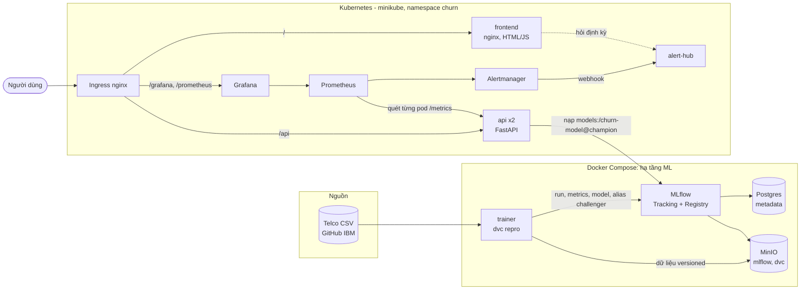
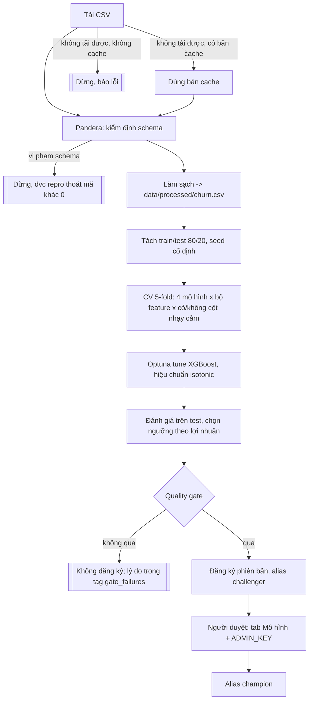
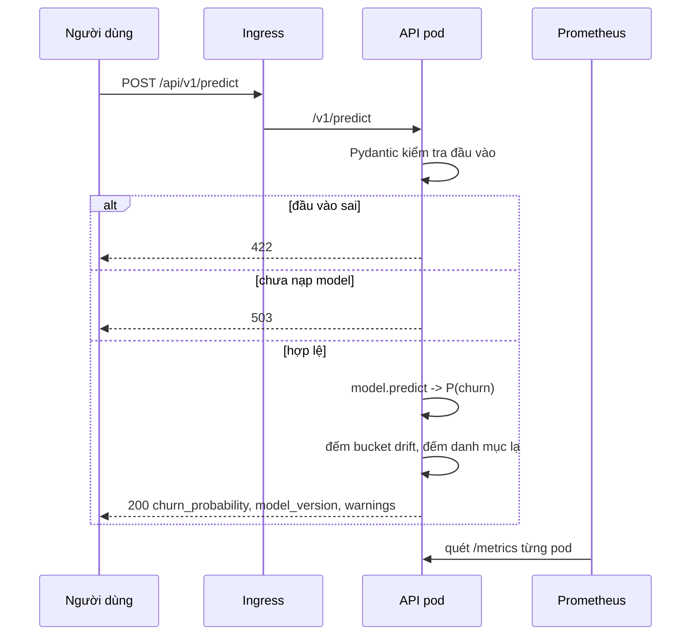

# Kiến trúc hệ thống

Tài liệu thiết kế của hệ thống dự đoán churn (Telco Customer Churn). Gồm: kiến trúc tổng thể, trách nhiệm từng thành phần, luồng dữ liệu và các trường hợp biên, lý do chọn công nghệ, và phân tích đánh đổi. Cách chạy và vận hành nằm ở [`docs/deployment-guide.md`](docs/deployment-guide.md); các quyết định thiết kế từng bước nằm ở [`docs/open-questions.md`](docs/open-questions.md).

## 1. Bối cảnh và yêu cầu thiết kế

Bộ phận chăm sóc khách hàng chỉ có ngân sách liên hệ một phần khách hàng mỗi kỳ. Hệ thống chấm điểm xác suất rời bỏ của từng khách để chọn nhóm đáng liên hệ nhất. Vì vậy thiết kế xoay quanh ba yêu cầu:

| Yêu cầu | Hệ quả thiết kế |
|---|---|
| Xác suất phải **dùng được để tính tiền**, không chỉ xếp hạng | Hiệu chuẩn isotonic; ngưỡng chọn theo lợi nhuận kỳ vọng (`src/training/business.py`), không dùng 0,5 cố định |
| Model sai không được tự lên production | Quality gate 3 điều kiện, alias `challenger` rồi người duyệt mới thành `champion`; mọi phiên bản được giữ để khôi phục |
| Phải biết khi nào model hoặc dữ liệu đầu vào lệch | Metric từng pod, PSI theo feature, luật cảnh báo có test |

Phạm vi và các giả định kinh tế (giá trị mất khách = `MonthlyCharges` x 12, chi phí ưu đãi 10%, tỷ lệ giữ chân thành công 30%) nằm ở `docs/open-questions.md`, Q1-Q5.

## 2. Kiến trúc tổng thể

Hạ tầng ML (MLflow, MinIO, Postgres, trainer) chạy trong Compose; phần phục vụ và giám sát chạy trong Kubernetes. Hai nửa nối nhau qua một địa chỉ duy nhất: API trong cụm gọi MLflow qua `host.minikube.internal:5001`.

CI/CD (không vẽ ở trên): `ci.yml` chạy lint, test, build trên mỗi push và PR; `deploy.yml` là workflow bấm tay, chạy trên self-hosted runner, build image arm64 vào Docker của cụm rồi `kubectl apply`.

## 3. Thành phần và trách nhiệm

| Thành phần | Mã nguồn | Trách nhiệm | Không làm |
|---|---|---|---|
| Data pipeline | `src/training/data.py` | Tải CSV, kiểm định bằng Pandera `SCHEMA`, làm sạch (ô `TotalCharges` trống thành NaN) | Không đụng tới model |
| Feature engineering | `src/training/features.py` | Biến đổi đầu vào, nằm **trong** pipeline sklearn nên huấn luyện và phục vụ dùng chung một đường xử lý | Không có kho feature riêng |
| Kinh tế | `src/training/business.py` | Lợi nhuận kỳ vọng, Recall@k, chọn k | |
| Huấn luyện | `src/training/train.py` | So sánh 4 mô hình (Dummy, LogReg, RF, XGBoost) bằng CV 5-fold, tune XGBoost bằng Optuna, hiệu chuẩn isotonic, ghi MLflow và báo cáo Evidently | Không tự duyệt model |
| Registry | `src/training/registry.py` | Quality gate (`passes_gate`), đặt alias, ghi provenance (commit, hash dữ liệu) | |
| Baseline drift | `baseline.py`, `buckets.py` | Lưu phân phối từng feature lúc huấn luyện; `buckets.py` chỉ dùng thư viện chuẩn để API dùng chung mà không kéo thêm Pandera | |
| Model wrapper | `src/training/model.py` | pyfunc trả P(churn) | |
| API | `src/serving/app.py`, `schemas.py` | `/v1/predict`, `/v1/model*`, duyệt và khôi phục, `/health`, `/ready`, `/metrics` | Không huấn luyện, không lưu dữ liệu khách hàng |
| Giám sát drift | `src/serving/drift.py` | Đếm giá trị đầu vào theo bucket vào bộ đếm Prometheus | Không lưu giá trị thô |
| Frontend | `frontend/` | UI tĩnh: Dự đoán, Lịch sử, Mô hình, Cảnh báo, Tài liệu; proxy `/api` | Không giữ trạng thái |
| Alert hub | `src/alerts/hub.py` | Nhận webhook Alertmanager, giữ danh sách cho tab Cảnh báo | Không gửi ra ngoài; Telegram do Alertmanager gửi trực tiếp (tùy chọn) |
| Giám sát | `k8s/monitoring/` | Prometheus, Alertmanager, Grafana (3 dashboard), 11 luật cảnh báo có `promtool test` | Chưa giám sát MLflow, MinIO, Postgres |

Ranh giới quan trọng: **mã phục vụ không được import `src.training.data`** (image API không có Pandera, test kiểm tra điều này), và schema Pandera `SCHEMA` phải khớp `CustomerFeatures` của API (một test kiểm tra).

## 4. Luồng dữ liệu

### 4.1 Huấn luyện đến model

Gate gồm ba điều kiện (`params.yaml`): PR-AUC tối thiểu 0,50; không kém baseline Logistic Regression; không kém champion hiện tại quá 0,005. DVC bỏ qua stage khi đầu vào không đổi, và `dvc.lock` ghim phiên bản dữ liệu và mã.

### 4.2 Một yêu cầu dự đoán

### 4.3 Trường hợp biên đã xử lý

| Tình huống | Hành vi | Nơi xử lý |
|---|---|---|
| Thiếu trường, sai kiểu, số ngoài khoảng | 422 với mô tả lỗi | `schemas.py` |
| Danh mục chưa từng thấy lúc huấn luyện | Vẫn chấm điểm, trả `warnings`, tăng bộ đếm `UNKNOWN_CATEGORY` | `app.py` |
| Chưa có champion, hoặc MLflow chưa tới được | API chạy nhưng `/ready` và `/v1/predict` trả 503; pod không nhận lưu lượng | readiness probe |
| Lỗi ghi metric drift | Chỉ ghi cảnh báo log, dự đoán vẫn trả về | `app.py` |
| Duyệt phiên bản không phải challenger | 409 | `/v1/model/promote` |
| Khôi phục về phiên bản không tương thích schema | 422, alias giữ nguyên (nạp và chấm thử trước khi đổi alias) | `/v1/model/rollback` |
| `ADMIN_KEY` rỗng | Tắt duyệt và khôi phục | `app.py` |
| Hai pod API thấy champion khác nhau sau khi duyệt | Pod nhận lệnh đổi ngay, pod còn lại theo kịp trong tối đa 30 giây | `MODEL_POLL_SECONDS` |
| Lệnh quản trị rơi vào pod canary | Lệnh quản trị đi qua Service `api-admin`, tách khỏi phần chia canary | `k8s/base/api.yaml` |
| Ít hơn 100 yêu cầu trong 1 giờ | Không tính PSI (nhiễu quá lớn) | luật Prometheus |
| Ô `TotalCharges` trống (khách mới) | Chuyển thành NaN, pipeline impute | `data.py` |

## 5. Dữ liệu và quyền riêng tư trong thiết kế

API **không lưu** yêu cầu hay dự đoán. Dữ liệu duy nhất rời khỏi request là các bộ đếm theo bucket (ví dụ "tenure 12-24 tháng: 37 lần"), không truy ngược được về một khách. Điều này tránh rủi ro lưu thông tin cá nhân, nhưng đổi lại hệ thống chưa đo được độ chính xác thật theo thời gian và chưa chạy được A/B (thiếu mã khách hàng và nhật ký dự đoán). Thảo luận đầy đủ về quyền riêng tư và đạo đức sẽ nằm trong tài liệu Responsible AI.

## 6. Lý do chọn công nghệ

| Lớp | Chọn | Vì sao | Phương án đã cân nhắc |
|---|---|---|---|
| Mô hình | XGBoost + hiệu chuẩn isotonic | Mạnh trên dữ liệu bảng, xử lý tốt tương tác giữa feature; hiệu chuẩn cho xác suất dùng được trong công thức lợi nhuận | Logistic Regression (giữ làm baseline: kết quả sát XGBoost), Random Forest, deep learning (quá nặng cho ~7.000 dòng) |
| Metric chính | PR-AUC | Lớp churn chiếm khoảng 26%, accuracy gây hiểu lầm | ROC-AUC (vẫn theo dõi) |
| Tracking và registry | MLflow | Đủ tracking, artifact và Model Registry với alias; miễn phí, tự chạy được | Weights & Biases (dịch vụ ngoài), DVC experiments (registry yếu) |
| Phiên bản dữ liệu | DVC, remote trên MinIO | Gắn dữ liệu với commit, `dvc repro` tái lập; stage không đổi thì bỏ qua | Git LFS (không có pipeline), tự đặt tên file |
| Kiểm định dữ liệu | Pandera | Schema dạng mã, lỗi rõ theo cột | Great Expectations (nặng hơn nhu cầu) |
| Tối ưu siêu tham số | Optuna | Gọn, tích hợp CV | Grid search (tốn công hơn) |
| API | FastAPI + Pydantic | Sinh OpenAPI/Swagger tự động từ schema, kiểm tra đầu vào, có `root_path` sau Ingress | Flask (tự viết validation), BentoML/Seldon (thêm tầng phụ thuộc) |
| Đóng gói | Docker multi-stage, người dùng không phải root (uid 10001), HEALTHCHECK | Image nhỏ, ít bề mặt tấn công | |
| Điều phối | Compose cho hạ tầng ML, Kubernetes (minikube) cho phục vụ | Compose đủ cho dịch vụ có trạng thái chạy một bản; K8s cho 2 bản sao API, readiness, canary, Ingress | Chạy tất cả trong Compose (không có canary, không có rolling update) |
| Giám sát | Prometheus + Alertmanager + Grafana | Chuẩn thực tế; quét từng pod nên bộ đếm của các bản sao không bị trộn | Datadog/Cloud Monitoring (tính phí) |
| Cảnh báo trên UI | alert-hub tự viết | Giao diện tĩnh không nhận được webhook, nên cần một bộ đệm | Dùng Grafana alerting (tách khỏi UI của sản phẩm) |
| Lưu trữ | Postgres (metadata), MinIO (artifact, dữ liệu) | Tách metadata và file lớn; MinIO tương thích S3 nên chuyển sang S3 thật chỉ cần đổi endpoint | SQLite và đĩa cục bộ (không dùng chung được) |
| CI/CD | GitHub Actions; deploy bằng self-hosted runner | Cụm chạy cục bộ, runner tự gọi ra GitHub nên không cần mở cổng | Deploy lên cloud (tốn tiền, ngoài phạm vi môn học) |

## 7. Phân tích đánh đổi

### 7.1 Khả năng mở rộng

| Điểm | Hiện tại | Giới hạn | Hướng mở rộng |
|---|---|---|---|
| API | 2 bản sao không giữ trạng thái, mô hình nạp vào bộ nhớ | Mỗi pod giữ một bản model; dự đoán đơn lẻ, chưa có batch | Tăng `replicas`, thêm HPA theo CPU hoặc độ trễ, thêm `/v1/predict/batch` |
| Giám sát | Prometheus một bản, giữ 7 ngày | Mất dữ liệu nếu xóa cụm | Remote write, hoặc Thanos |
| MLflow, MinIO, Postgres | Một bản, ngoài cụm | **Điểm đơn lẻ**; không sao lưu volume | Chuyển vào cụm hoặc dùng dịch vụ quản lý |
| Deploy | Phụ thuộc một chiếc Mac đang bật | Mac tắt thì không deploy được | Runner trên VM, hoặc build đa kiến trúc |

Quy mô dữ liệu (7.000 dòng, một XGBoost) khiến độ trễ dự đoán nhỏ; nút cổ chai thực tế là độ tin cậy hạ tầng chứ không phải thông lượng.

### 7.2 Chi phí

Toàn bộ chạy cục bộ nên chi phí tiền bằng 0, đổi lại là chi phí vận hành: một máy duy nhất, minikube cần khoảng 4 GB RAM, và image MinIO là bản đóng băng (`bitnamilegacy/minio:2024.12.18`, không nhận bản vá, không dùng cho production). Khi lên cloud, các chi phí chính sẽ là cụm K8s, object storage và Postgres quản lý.

### 7.3 Độ phức tạp

| Quyết định | Được | Mất |
|---|---|---|
| Duyệt model bằng tay | Model xấu không tự lên production | Thêm một bước thủ công, chậm hơn CD thuần |
| Feature engineering nằm trong pipeline | Không lệch giữa huấn luyện và phục vụ (training-serving skew) | Không dùng lại được feature cho model khác như với kho feature |
| Hai môi trường (Compose + K8s) | Mỗi nơi làm đúng việc phù hợp | Hai bộ cấu hình, địa chỉ nối qua `host.minikube.internal` |
| Prometheus quét từng pod | Số liệu đúng theo bản sao và theo phiên bản | Cấu hình nhận diện pod qua annotation phức tạp hơn quét qua Service |
| PSI trên cửa sổ 1 giờ | Phát hiện lệch đầu vào sớm, không lưu dữ liệu khách | Nhiễu khi ít lưu lượng (ngưỡng tối thiểu 100 dự đoán) |
| Không lưu nhật ký dự đoán | Giữ riêng tư | Chưa đo được chất lượng thực tế, chưa A/B |
| Ngưỡng theo lợi nhuận với giả định ghi cứng | Gắn model với quyết định kinh doanh | Kết quả phụ thuộc ba giả định chưa kiểm chứng với dữ liệu thật |

## 8. Hạn chế đã biết

Danh sách đầy đủ ở `docs/deployment-guide.md`, mục 7. Những điểm ảnh hưởng tới thiết kế: image trên cụm không phải image CI đã đẩy lên GHCR (CI build amd64, cụm chạy arm64); canary và A/B chưa nối với luồng duyệt model; cảnh báo chỉ hiện trên UI, chưa có kênh ngoài; hạ tầng ML chưa được giám sát và chưa sao lưu; chưa có SHAP/LIME, phân tích công bằng và endpoint batch.
