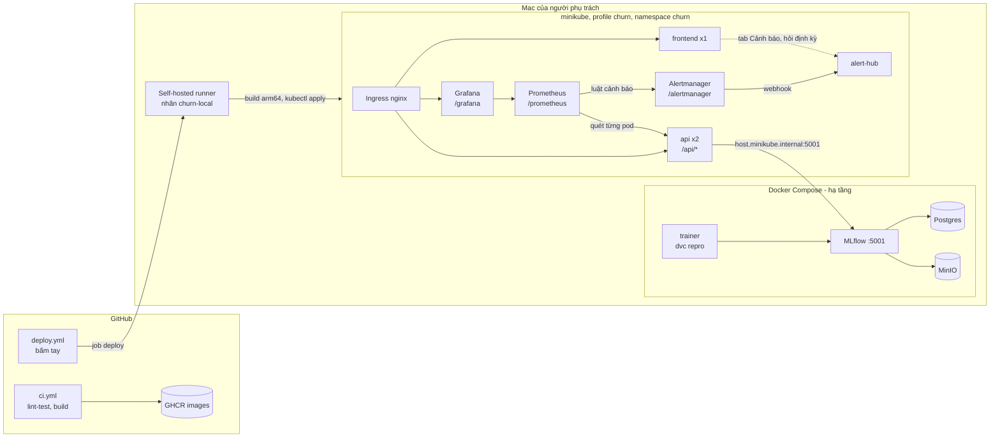

# Hướng dẫn triển khai và vận hành

Tài liệu tổng hợp luồng triển khai hiện tại: hệ thống chạy ở đâu, đi từ code đến người dùng thế nào, vận hành hằng ngày ra sao và xử lý sự cố. Chi tiết từng phần nằm ở [`k8s/README.md`](../k8s/README.md) (cụm Kubernetes), [`rollout-strategies.md`](rollout-strategies.md) (khôi phục, canary, A/B) và [`open-questions.md`](open-questions.md) (các quyết định thiết kế).

Mục 7 liệt kê những gì **chưa làm hoặc chưa kiểm chứng**; hãy đọc trước khi dựa vào một tính năng.

## 1. Kiến trúc



| Thành phần | Chạy ở | Vai trò | Truy cập |
|---|---|---|---|
| Postgres | Compose | Metadata của MLflow (run, version, alias) | nội bộ |
| MinIO | Compose | File model, artifact, dữ liệu DVC (bucket `mlflow`, `dvc`) | 9000 (S3), 9001 (console) |
| MLflow | Compose | Tracking server và Model Registry | http://localhost:5001 |
| Prometheus | minikube | Quét từng pod API, đánh giá 11 luật cảnh báo, giữ dữ liệu 7 ngày (PVC) | `/prometheus/` |
| Alertmanager | minikube | Gom nhóm cảnh báo, gửi webhook tới alert-hub | `/alertmanager/` |
| alert-hub | minikube | Nhận webhook, giữ danh sách cảnh báo cho tab Cảnh báo (cùng image với API, một bản sao) | tab Cảnh báo |
| Grafana | minikube | 3 dashboard: API, Mô hình, So sánh phiên bản | `/grafana/` (admin) |
| trainer | Compose (profile `train`) | Chạy pipeline huấn luyện | `docker compose run --rm trainer ...` |
| api (2 bản sao) | minikube | Dự đoán, duyệt/khôi phục model | `http://localhost:8088/api/...` |
| frontend | minikube | Giao diện web | http://localhost:8088 |
| Ingress | minikube | `/api/*` vào API, còn lại vào giao diện | qua `kubectl port-forward` (mục 3) |
| Runner | máy Mac (LaunchAgent) | Thực hiện job deploy | `~/actions-runner-ddm501` |

## 2. Luồng từ code đến người dùng

Có ba luồng độc lập.

### 2.1 Code (API, giao diện, hạ tầng)

```
push/PR --> CI: lint-test (ruff, pytest) + build (kiểm tra Dockerfile, đẩy GHCR khi push main)
                      |
   (chờ CI xanh)      v
bấm "Deploy to local Kubernetes" --> kiểm tra runner --> build arm64 --> kubectl apply --> smoke test
```

**Push không tự deploy.** Deploy là một workflow bấm tay (`workflow_dispatch`), chi tiết ở mục 4. Nút này deploy bất kể CI của commit đó xanh hay đỏ, nên chỉ bấm khi CI đã xanh.

### 2.2 Model (huấn luyện, duyệt, khôi phục)

```
dvc repro --> qua quality gate? --yes--> alias "challenger" (CHƯA phục vụ)
                                              |
        người duyệt: tab Mô hình, nút Duyệt + ADMIN_KEY
                                              v
                                   alias "champion"  --> API phục vụ ngay
```

- Huấn luyện **không bao giờ tự duyệt**: chỉ đặt `challenger`. Không qua gate thì model không được đăng ký (lý do nằm trong tag `gate_failures` của run MLflow).
- Duyệt (`POST /v1/model/promote`): cần `ADMIN_KEY`, chỉ nhận đúng phiên bản đang là `challenger`, nạp model và chạy thử trước khi đổi alias, ghi tag `approved_at`.
- Khôi phục (`POST /v1/model/rollback`, nút Khôi phục ở bảng Lịch sử phiên bản): cùng khóa, cùng cách kiểm tra trước khi đổi. Mọi phiên bản đã đăng ký đều được giữ lại.
- Bản sao API nhận lệnh đổi ngay; các bản sao khác theo kịp trong tối đa 30 giây (`MODEL_POLL_SECONDS=30`).

### 2.3 Canary (thủ công)

`kubectl apply -k k8s/canary` thêm một bản API **ghim** vào một phiên bản (mặc định v2) và nhận 20% lưu lượng `/api`. Nó tách rời khỏi luồng duyệt model: chưa có luồng "challenger vào canary rồi mới duyệt". Xem `k8s/README.md`.

### 2.4 Giám sát và cảnh báo

```
pod API --/metrics--> Prometheus --luật--> Alertmanager --webhook--> alert-hub <--hỏi 20s-- tab Cảnh báo
                          |
                          +--> Grafana (Churn: API, Churn: Mô hình, Churn: So sánh phiên bản)
```

- Prometheus tìm pod nhờ annotation `prometheus.io/*` và quét **từng pod** (không qua Service), nên bộ đếm của hai bản sao không bị trộn. Pod canary (`track=canary`) cũng được quét.
- Cảnh báo về tới giao diện bằng **webhook**: trang giao diện là tệp tĩnh nên không tự nhận webhook, vì vậy alert-hub nhận và giao diện hỏi lại định kỳ. Chấm đỏ trên tab cho biết số cảnh báo đang bắn.
- Hub chỉ nhớ danh sách trong bộ nhớ: sau khi khởi động lại nó đọc lại các cảnh báo **đang bắn** từ Alertmanager, nhưng **nhật ký sự kiện đã xử lý bị mất**.
- **Drift theo feature**: huấn luyện lưu `feature_baseline.json` (phân phối từng đầu vào) vào run MLflow; khi nạp model, API xuất `churn_feature_baseline_share` và tạo sẵn các bộ đếm `churn_feature_values_total{model_version,feature,bucket}` ở mức 0; Prometheus tính `churn:feature_psi:1h` và cảnh báo `FeatureDrift` khi PSI > 0,2 kéo dài 30 phút. Không có dữ liệu khách hàng nào được lưu, chỉ số đếm theo nhóm.
- Ngưỡng và ý nghĩa từng luật: bảng trong `README.md`, mục Giám sát. Mỗi luật có test với dữ liệu giả (`k8s/monitoring/prometheus/alerts_test.yml`).

## 3. Chạy lần đầu

Yêu cầu: Docker Desktop (khuyến nghị cấp từ 8 GB RAM), minikube, kubectl, `gh` đã đăng nhập, Python không cần cài.

```bash
# 1. Khóa quản trị (tệp .env không được commit)
cp .env.example .env            # đặt ADMIN_KEY và GRAFANA_ADMIN_PASSWORD, ví dụ: openssl rand -hex 24

# 2. Hạ tầng
docker compose up -d --build    # MLflow, MinIO, Postgres

# 3. Huấn luyện, tạo model đầu tiên
GIT_COMMIT=$(git rev-parse HEAD) GIT_DIRTY=$(git status --porcelain | wc -l) \
  docker compose run --rm trainer dvc repro

# 4. Cụm Kubernetes (chi tiết trong k8s/README.md)
minikube start -p churn --driver=docker --cpus=4 --memory=4096
minikube -p churn addons enable ingress
kubectl apply -f k8s/base/namespace.yaml
kubectl -n churn create secret generic churn-secrets --from-env-file=.env   # tạo tay một lần
scripts/deploy-local.sh                                                      # build + triển khai api, frontend và giám sát

# 5. Mở cổng ra máy rồi vào http://localhost:8088, tab Mô hình, duyệt model đầu tiên
kubectl -n ingress-nginx port-forward svc/ingress-nginx-controller 8088:80
```

Cho đến khi có model mang alias `champion`, API chạy nhưng `/ready` và `/v1/predict` trả 503 (có chủ đích).

Cài runner cho nút deploy (một lần): tải bản chính thức từ `github.com/actions/runner`, kiểm tra checksum, đăng ký với nhãn `churn-local`, rồi `./svc.sh install && ./svc.sh start`. Các lệnh quản lý có trong `k8s/README.md`.

## 4. Nút deploy trên GitHub

Actions, **Deploy to local Kubernetes**, **Run workflow**, chọn nhánh.

| Bước | Chạy ở | Làm gì |
|---|---|---|
| `Is the self-hosted runner running?` | GitHub | Chờ tối đa 60 giây xem runner có nhận job `deploy` không. Không nhận thì hủy run và ghi lỗi |
| `deploy` | Runner trên Mac | Kiểm tra Docker và MLflow, đảm bảo cụm chạy, build image arm64 vào Docker của cụm, `kubectl apply` với tag là commit, đợi cuốn bản mới, smoke test |

Lý do có bước kiểm tra runner: job gửi tới runner đang offline sẽ nằm chờ tới 24 giờ. API trạng thái runner cần quyền admin mà `GITHUB_TOKEN` không có, nên bước này theo dõi xem runner có nhận job không thay vì hỏi trạng thái.

### Điều gì hiện trên GitHub khi có sự cố

| Tình huống | Hiển thị | Đã thử? |
|---|---|---|
| Mọi thứ ổn | Cả hai job xanh, khoảng 1 đến 4 phút | Có |
| **Runner offline** (Mac tắt, dịch vụ dừng) | Sau khoảng 60 giây có annotation lỗi đỏ "Self-hosted runner is not running..." kèm cách bật lại; run kết thúc ở trạng thái **Cancelled** (xám, không phải đỏ) sau khoảng 105 giây; cụm không bị đụng tới | Có |
| Runner bật, **Docker hoặc MLflow không chạy** | Job `deploy` đỏ, log ghi "Docker is not running" hoặc "MLflow is not reachable on localhost:5001" | Chưa (chỉ đọc code) |
| Cụm minikube đang tắt | Script tự `minikube start` rồi tiếp tục | Chưa |
| API chạy nhưng không có model | Smoke test lỗi, job đỏ: "API is up but has no model" | Chưa |
| Mất kết nối giữa chừng (Mac ngủ, rớt mạng) | Job treo rồi lỗi khi GitHub coi runner mất; giới hạn 20 phút. K8s giữ pod cũ cho đến khi pod mới sẵn sàng | Chưa |
| Bấm hai lần liên tiếp | Run thứ hai xếp hàng chờ run đầu (`concurrency: deploy-local`) | Chưa |

## 5. Vận hành hằng ngày

| Việc | Lệnh |
|---|---|
| Mở giao diện | `kubectl -n ingress-nginx port-forward svc/ingress-nginx-controller 8088:80` rồi http://localhost:8088 |
| Xem trạng thái cụm | `kubectl -n churn get pods` |
| Xem log API | `kubectl -n churn logs deploy/api` |
| Ép API nạp lại model | `kubectl -n churn rollout restart deploy/api` |
| Deploy tay (không qua GitHub) | `scripts/deploy-local.sh` |
| Huấn luyện | `docker compose run --rm trainer dvc repro` |
| Chạy test | `docker compose run --rm trainer pytest -q` |
| Dừng cụm khi không dùng (giải phóng khoảng 4 GB) | `minikube stop -p churn` |
| Kiểm tra runner | `cd ~/actions-runner-ddm501 && ./svc.sh status` |

Cấu hình qua biến môi trường của API: `MODEL_URI` (mặc định `models:/churn-model@champion`; `models:/churn-model/3` để ghim một phiên bản), `MODEL_POLL_SECONDS` (theo dõi alias, K8s đặt 30), `ADMIN_KEY` (rỗng thì tắt duyệt/khôi phục), `ROOT_PATH` (`/api` khi đứng sau Ingress), `LOG_LEVEL` (mặc định `INFO`; `DEBUG` để thấy cả probe và scrape). Đổi `ADMIN_KEY` trong `.env` thì phải tạo lại Secret `churn-secrets` rồi `rollout restart deploy/api`.

### Bật cảnh báo qua Telegram

Alertmanager gửi thẳng tới Telegram bằng receiver có sẵn; không qua alert-hub, và tab Cảnh báo vẫn nhận như cũ.

1. Tạo bot với `@BotFather`, lấy token. Nhắn một tin cho bot (hoặc thêm bot vào nhóm rồi nhắn trong nhóm), rồi mở `https://api.telegram.org/bot<TOKEN>/getUpdates` để lấy `chat.id` (số nguyên, nhóm thì âm).
2. Điền `TELEGRAM_BOT_TOKEN` và `TELEGRAM_CHAT_ID` vào `.env`.
3. Tạo lại Secret và khởi động lại Alertmanager:

```bash
kubectl -n churn create secret generic churn-secrets --from-env-file=.env --dry-run=client -o yaml | kubectl apply -f -
kubectl -n churn rollout restart deploy/alertmanager
kubectl -n churn logs deploy/alertmanager -c render-config   # "Telegram notifications enabled"
```

Init container `render-config` chọn cấu hình lúc pod khởi động: có đủ hai khóa thì dùng `alertmanager-telegram.yml` (điền chat id, ghi token ra tệp), thiếu thì dùng `alertmanager.yml` chỉ gửi vào hub. Sau khi tạo lại Secret, nhớ khởi động lại `deploy/api` và `deploy/grafana` nếu bạn đã đổi `ADMIN_KEY` hoặc mật khẩu Grafana. Tin gửi dạng văn bản thuần: `[CRITICAL] tên cảnh báo`, tóm tắt, mô tả; khi hết cảnh báo có tin `[RESOLVED]`. Nhóm cảnh báo lặp lại sau 4 giờ nếu vẫn bắn (`repeat_interval`).

### Log của API

Xem bằng `kubectl -n churn logs deploy/api` (thêm `-f` để theo dõi). Mỗi dòng có dạng `thời gian MỨC logger [request-id] nội dung`. Mỗi yêu cầu tới `/v1/*` có đúng một dòng: `POST /v1/predict -> 200 in 23.0 ms (model v3)`. Dòng không có query string hay nội dung yêu cầu, nên không chứa dữ liệu khách hàng. `/health`, `/ready`, `/metrics` chỉ hiện ở mức `DEBUG`. Lỗi 500 trong dự đoán có đủ stack trace. Duyệt và khôi phục model ghi dòng `admin action=... ok|denied|failed` (không ghi khóa).

Mã yêu cầu lấy từ header `X-Request-ID` nếu người gọi gửi (chỉ chấp nhận chữ, số, `.`, `_`, `-`, tối đa 64 ký tự), không thì API tự sinh; mã này có trong mọi dòng log của yêu cầu và trong header trả về, để lần theo một lần gọi.

**Log chưa được gom về một chỗ.** Prometheus chỉ thu số liệu, không thu log; trong cụm chưa có Loki hay bộ gom log nào, nên log chỉ xem được bằng `kubectl logs` và mất khi pod bị thay. Phần của log đã thành số liệu trong Prometheus: `churn_requests_total` (theo mã trạng thái, gồm 4xx và 5xx), `churn_unknown_category_total` và `churn_admin_actions_total` (duyệt, khôi phục theo kết quả ok, denied, failed).

## 6. Xử lý sự cố

| Triệu chứng | Nguyên nhân thường gặp | Cách xử lý |
|---|---|---|
| Không vào được http://localhost:8088 | Lệnh `port-forward` đã dừng (không bền qua khởi động lại) | Chạy lại lệnh ở mục 5 |
| Giao diện báo "API chạy nhưng chưa có model" | Chưa có `champion`, hoặc API không với tới MLflow | Duyệt model ở tab Mô hình; kiểm tra `docker compose ps` và `curl localhost:5001/health` |
| Pod `ImagePullBackOff` | Image chưa có trong Docker của cụm | Chạy `scripts/deploy-local.sh` (build vào Docker của cụm) |
| Duyệt trả "Invalid admin key" | Khóa trên giao diện khác khóa trong Secret | So `.env` với Secret, tạo lại Secret nếu đã đổi |
| Duyệt trả 409 | Challenger đã đổi, hoặc yêu cầu rơi vào bản canary ghim | Tải lại trang; lệnh quản trị đã được định tuyến vào nhóm stable qua Service `api-admin` |
| Khôi phục trả 422 | Phiên bản cũ không tương thích schema API hiện tại | Không có gì thay đổi; chọn phiên bản khác |
| Deploy báo runner không chạy | Dịch vụ runner dừng hoặc Mac tắt | `./svc.sh start`, mở Docker Desktop, bấm lại |
| `dvc repro` thoát mã khác 0 | Không qua quality gate | Xem tag `gate_failures` của run trên MLflow |
| Dashboard Grafana trống | Chưa có lưu lượng (nhiều số liệu là tỷ lệ theo thời gian), hoặc Prometheus không quét được pod | Gửi vài yêu cầu dự đoán; mở `/prometheus/targets` xem `churn-api` có `up` |
| Không đăng nhập được Grafana | Dùng sai mật khẩu | Tài khoản `admin`, mật khẩu là `GRAFANA_ADMIN_PASSWORD` trong Secret `churn-secrets` (đổi trong `.env` thì tạo lại Secret và `rollout restart deploy/grafana`) |
| Cảnh báo đã bắn trên Prometheus mà tab Cảnh báo trống | alert-hub chưa nhận được webhook | Xem `/alertmanager/` (nhóm có gửi không) và `kubectl -n churn logs deploy/alert-hub`; hub tự đọc lại cảnh báo đang bắn từ Alertmanager khi khởi động |
| Cảnh báo `PredictionDrift` hoặc `FeatureDrift` bất ngờ | Có lưu lượng bị lệch (ví dụ thử nghiệm lặp lại một kiểu khách) | Đúng thiết kế: tự hết khi dữ liệu lệch quá 1 giờ |
| Panel PSI trống | Dưới 100 dự đoán trong 1 giờ, hoặc model đang chạy chưa có `feature_baseline.json` | Gửi thêm yêu cầu; với model cũ chạy `python -m src.training.baseline` (xem README, mục Giám sát) rồi khởi động lại API |

## 7. Chưa làm hoặc chưa kiểm chứng

- **Image chạy trên cụm không phải image CI đã đẩy lên GHCR.** CI build amd64, cụm chạy arm64, nên runner build lại. Deploy đúng image CI cần build đa kiến trúc.
- **Cần Mac bật, đã đăng nhập và Docker Desktop chạy** để deploy được; đây là điểm đơn lẻ có thể hỏng. Không có môi trường dự phòng.
- **Runner trên repo công khai** vẫn là rủi ro: PR từ người ngoài phải được duyệt trước khi chạy CI, và workflow deploy chỉ chạy tay, nhưng nếu một thành viên duyệt nhầm PR độc hại thì mã của nó chạy trên máy này. `main` chưa bật bảo vệ nhánh.
- **Canary và A/B chưa nối với luồng duyệt model.** A/B còn thiếu mã khách hàng trong request và nhật ký dự đoán (xem `rollout-strategies.md`).
- **Postgres, MinIO, MLflow chưa chạy trong cụm**; image MinIO là bản đóng băng (`bitnamilegacy`). Chưa có sao lưu volume Docker: mất volume là mất model.
- **Mật khẩu mặc định** của MinIO, Grafana, Postgres vẫn nằm trong `docker-compose.yml` (Q20 chưa chuyển hết sang `.env`); mới có `ADMIN_KEY`.
- SHAP/LIME, phân tích công bằng, endpoint `/v1/predict/batch` chưa làm.
- Các tình huống lỗi đánh dấu "Chưa" ở mục 4 chưa được thử thật.

Về giám sát cụ thể:

- **Cảnh báo luôn vào tab Cảnh báo; Telegram là tùy chọn** (mục 5, "Bật cảnh báo qua Telegram"). Chưa có Slack hay email; thêm một receiver vào `alertmanager-telegram.yml` (hoặc một tệp tương tự) là đủ.
- **Ngưỡng cảnh báo là điểm khởi đầu chưa đo từ dữ liệu thật**; nền 0,27 của `PredictionDrift` được ghi cứng trong luật.
- **Drift theo feature dùng PSI trên cửa sổ 1 giờ**: ít yêu cầu thì PSI nhiễu (cỡ (số nhóm − 1) / số yêu cầu, khoảng 0,04 với 240 yêu cầu), nên chỉ tính khi có trên 100 dự đoán. Model huấn luyện trước tính năng này không được giám sát cho tới khi bổ sung thống kê. Chưa lưu nhật ký dự đoán (vì vậy chưa đo được độ chính xác thật hay chạy A/B).
- **Dashboard Grafana mới được kiểm tra bằng truy vấn** (31 trong 33 biểu thức có dữ liệu, 0 lỗi; 2 biểu thức lỗi 5xx đã được sửa để hiện 0), tôi chưa xem giao diện Grafana bằng mắt. Dashboard "So sánh phiên bản" chưa được chạy với hai phiên bản thật.
- **Hạ tầng không được giám sát**: MLflow, MinIO, Postgres và tài nguyên của node chưa có số liệu hay cảnh báo.
- **Dữ liệu giám sát nằm trên máy này**: Prometheus (PVC minikube, 7 ngày) mất nếu xóa cụm; Alertmanager và Grafana dùng `emptyDir`.
- **Liên kết trong Alertmanager/Prometheus dùng `localhost:8088`** (địa chỉ cổng chuyển tiếp), nên chỉ đúng khi mở qua cổng đó.
- **Sau khi bấm deploy, nhật ký cảnh báo trong hub bị xóa** vì pod hub được khởi động lại.
