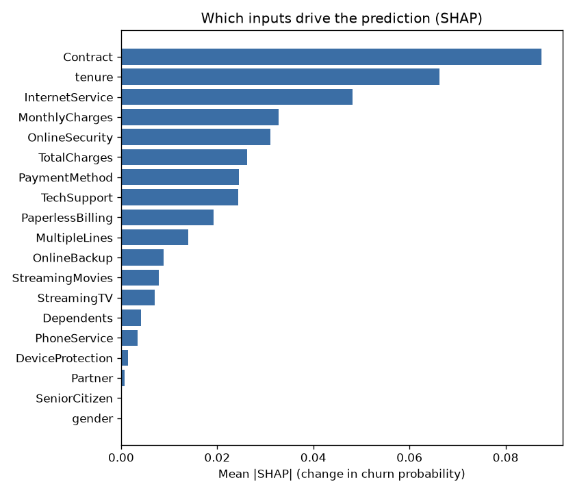
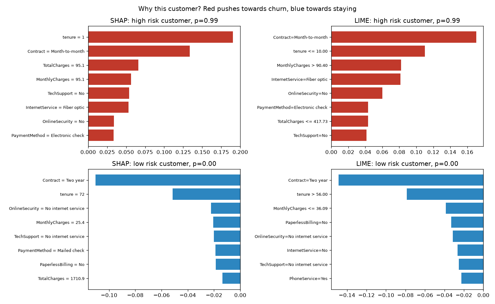
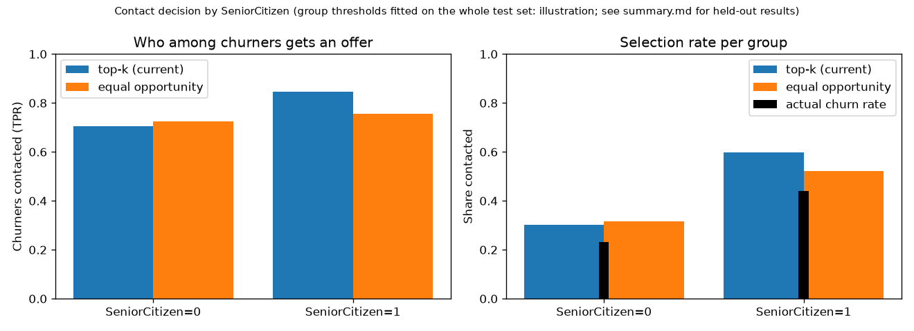

# Responsible AI: giải thích mô hình, công bằng, quyền riêng tư, đạo đức

Tài liệu này trả lời phần Responsible AI của đề bài: phân tích công bằng và biện pháp giảm thiên lệch, giải thích mô hình bằng hơn một phương pháp (SHAP và LIME), thảo luận quyền riêng tư dữ liệu và đạo đức.

Số liệu lấy từ báo cáo tự sinh [`reports/responsible_ai/summary.md`](../reports/responsible_ai/summary.md) (chi tiết đầy đủ trong `results.json` cùng thư mục). Bản đang có trong repo được tạo từ một lần huấn luyện tái lập trên cùng code, dữ liệu và `params.yaml` (PR-AUC test 0,661, gần với 0,663 của `champion` v3); các con số có thể lệch nhẹ so với v3. Để tạo lại cho model đang phục vụ:

```bash
docker compose run --rm trainer python -m src.responsible.report --log-to-run
```

Lệnh dựng lại đúng cách chia train/test của bước huấn luyện, chấm điểm tập test bằng model đã đăng ký, rồi ghi `summary.md`, `results.json` và 3 hình vào `reports/responsible_ai/`. Với `--log-to-run`, cả thư mục và các chỉ số chính (`rai_senior_selection_gap`, `rai_senior_tpr_gap`, `rai_lime_shap_agreement`) được ghi vào run MLflow của model, cạnh các chỉ số chất lượng. Mã nguồn: `src/responsible/` (`explain.py`, `fairness.py`, `report.py`); test: `tests/test_responsible.py`.

## 1. Quyết định nào ảnh hưởng tới con người?

Model chỉ chấm điểm. Quyết định tác động tới khách hàng là **ai được liên hệ kèm ưu đãi giữ chân**: bộ phận chăm sóc liên hệ k% khách có điểm cao nhất, với k chọn theo lợi nhuận (35% ở lần huấn luyện hiện tại, xem `src/training/business.py`). Ưu đãi là một **lợi ích** (giảm giá, quà), nên câu hỏi công bằng ở đây là: *lợi ích đó có được phân bổ công bằng giữa các nhóm khách không?* Mọi chỉ số công bằng bên dưới đo trên quyết định liên hệ này, không đo trên xác suất thô.

## 2. Giải thích mô hình

### 2.1 Phương pháp

Cả hai phương pháp coi model đang phục vụ là hộp đen: 19 cột thô vào, xác suất churn đã hiệu chuẩn ra. Vì vậy lời giải thích dùng đúng ngôn ngữ của API và nghiệp vụ (`Contract`, `tenure`), không phải các cột one-hot bên trong pipeline. Cột phân loại được mã hóa thành số nguyên cho bộ giải thích và giải mã lại thành chữ trước mỗi lần gọi model (`RawEncoder`).

| | SHAP (permutation) | LIME |
|---|---|---|
| Ý tưởng | Giá trị Shapley: đóng góp trung bình của mỗi đầu vào qua mọi thứ tự "bật" đầu vào | Khớp một mô hình tuyến tính nhỏ quanh một khách, trên các bản sao bị nhiễu của khách đó |
| Phạm vi | Cục bộ (từng khách) và toàn cục (trung bình trị tuyệt đối) | Chỉ cục bộ |
| Tính chất | **Cộng tính**: xác suất nền + tổng đóng góp = xác suất dự đoán (sai số đo được: 0) | Không cộng tính; kết quả phụ thuộc mẫu nhiễu ngẫu nhiên |
| Chi phí | Gọi model nhiều lần cho mỗi khách; báo cáo giải thích 200 khách so với 50 khách nền | Khoảng 2.000 lần gọi cho mỗi khách |

Dùng hai phương pháp khác nhau vì nếu cả hai cùng chỉ ra một lý do thì lời giải thích đáng tin hơn. Trên 20 khách, trung bình **72%** trong 5 đầu vào LIME xếp cao nhất cũng nằm trong top 5 của SHAP.

### 2.2 Toàn cục: điều gì làm khách rời đi?



Ba đầu vào quan trọng nhất là `Contract`, `tenure` và `InternetService`. Hướng ảnh hưởng (trung bình đóng góp SHAP theo từng giá trị, dương là đẩy về phía rời bỏ):

| Đầu vào | Tăng rủi ro | Giảm rủi ro |
|---|---|---|
| `Contract` | Month-to-month +0,075 | One year −0,083; Two year −0,127 |
| `InternetService` | Fiber optic +0,049 | DSL −0,051; không dùng internet −0,041 |
| `PaymentMethod` | Electronic check +0,033 | Các cách còn lại khoảng −0,02 |
| `TechSupport` | Không có hỗ trợ kỹ thuật +0,024 | Có hỗ trợ −0,026 |

Các quan hệ này hợp lý về nghiệp vụ và khớp với hiểu biết phổ biến về dữ liệu Telco, nên không có dấu hiệu model học "lối tắt" vô lý. `gender` và `SeniorCitizen` không nằm trong 10 đầu vào quan trọng nhất (model được chọn đã bỏ hai cột này, xem mục 3.3).

### 2.3 Cục bộ: vì sao khách này?



- **Khách rủi ro cao** (xác suất 0,99): mới dùng 1 tháng, hợp đồng theo tháng, cáp quang, không có bảo mật và hỗ trợ kỹ thuật, trả bằng séc điện tử. SHAP và LIME đồng ý về các lý do chính; SHAP xếp `tenure` lên đầu, LIME xếp `Contract` lên đầu.
- **Khách rủi ro thấp** (xác suất gần 0): hợp đồng 2 năm, đã dùng 72 tháng, không dùng internet, cước thấp. Cả hai phương pháp đều đặt hợp đồng 2 năm lên đầu.

Giá trị thực tế: lời giải thích cục bộ cho nhân viên biết **nên đưa ưu đãi gì**. Khách rủi ro vì hợp đồng theo tháng thì đề nghị chuyển sang hợp đồng năm có giảm giá; khách rủi ro vì thiếu hỗ trợ kỹ thuật thì tặng gói hỗ trợ.

### 2.4 Giới hạn của lời giải thích

- `tenure`, `TotalCharges` và `MonthlyCharges` tương quan mạnh (tổng cước ≈ cước tháng × số tháng). SHAP permutation giả định các đầu vào độc lập, nên có thể chia "công" giữa chúng một cách tùy ý, và tạo ra những khách không thực tế khi hoán đổi giá trị. Nên đọc ba cột này như một nhóm.
- LIME dùng mẫu ngẫu nhiên: chạy lại có thể đổi thứ tự các đầu vào có trọng số gần nhau. Báo cáo cố định seed để tái lập được.
- Giải thích cho biết **model** dựa vào gì, không chứng minh **quan hệ nhân quả**. Hợp đồng theo tháng đi kèm rủi ro cao, nhưng ép khách ký hợp đồng dài chưa chắc giữ được họ.

## 3. Công bằng

### 3.1 Thuộc tính nhạy cảm và định nghĩa công bằng

Dữ liệu có hai thuộc tính nhạy cảm: `gender` và `SeniorCitizen` (khách cao tuổi). Hai cột luôn được giữ trong dữ liệu để đo, kể cả khi model không dùng chúng làm đầu vào (quyết định Q7).

Nhóm chọn **equal opportunity** (cơ hội ngang nhau) làm định nghĩa chính: *trong số những khách thật sự sắp rời đi, mỗi nhóm có cùng cơ hội nhận ưu đãi* (TPR bằng nhau). Lý do không chọn **demographic parity** (tỷ lệ được liên hệ bằng nhau): tỷ lệ rời bỏ thật giữa các nhóm khác nhau rất nhiều (44% ở khách cao tuổi so với 23%). Ép tỷ lệ liên hệ bằng nhau nghĩa là bỏ qua nhiều khách cao tuổi sắp đi để gọi những khách trẻ không định đi, vừa tốn ngân sách vừa không công bằng hơn với ai.

### 3.2 Kết quả (liên hệ 35% khách, 1.409 khách test)

| Nhóm | Số khách | Churn thật | Xác suất TB | Được liên hệ | TPR | FPR | Precision |
|---|---|---|---|---|---|---|---|
| Không cao tuổi | 1.187 | 23,2% | 24,2% | 30,3% | 70,7% | 18,1% | 54,2% |
| Cao tuổi | 222 | 44,1% | 39,9% | 59,9% | 84,7% | 40,3% | 62,4% |
| Nữ | 687 | 28,1% | 26,9% | 35,2% | 73,1% | 20,4% | 58,3% |
| Nam | 722 | 25,1% | 26,6% | 34,8% | 75,7% | 21,1% | 54,6% |

**`gender`: không có chênh lệch đáng kể** (tỷ lệ được liên hệ chênh 0,5 điểm %, TPR chênh 2,6 điểm %, tỷ số disparate impact 0,99).

**`SeniorCitizen`: có chênh lệch, theo hướng có lợi cho khách cao tuổi.**

- Khách cao tuổi được liên hệ gấp đôi (59,9% so với 30,3%; disparate impact 0,51, dưới mốc 0,8 thường dùng). Phần lớn chênh lệch này đến từ tỷ lệ rời bỏ thật cao gấp đôi, nên bản thân nó chưa phải là bất công.
- Nhưng ngay cả khi chỉ xét khách sắp rời đi, khách cao tuổi vẫn được liên hệ nhiều hơn (TPR 84,7% so với 70,7%, **chênh 14 điểm %**). Nói cách khác, một khách trẻ sắp rời đi có ít cơ hội nhận ưu đãi hơn một khách cao tuổi sắp rời đi.
- Model hơi **đánh giá thấp** rủi ro của khách cao tuổi (xác suất trung bình 39,9% so với tỷ lệ thật 44,1%), trong khi gần đúng với nhóm còn lại.

### 3.3 Vì sao bỏ cột `SeniorCitizen` không xóa được chênh lệch?

Model được chọn đã **không dùng** `gender` và `SeniorCitizen` làm đầu vào (quy tắc chọn trong `train.py` ưu tiên bỏ cột nhạy cảm nếu chỉ mất tối đa 0,005 PR-AUC). Chênh lệch vẫn còn vì các cột khác mang thông tin thay thế (**proxy**): một mô hình logistic đoán được `SeniorCitizen` từ 17 cột còn lại với ROC-AUC **0,79**. Ngược lại, `gender` gần như không đoán được (ROC-AUC 0,47), khớp với việc không có chênh lệch theo giới tính. Đây là bài học "bỏ thuộc tính nhạy cảm không đảm bảo công bằng" (giống vụ AI tuyển dụng của Amazon).

### 3.4 Biện pháp giảm thiên lệch: ngưỡng theo nhóm (post-processing)

`fairness.equal_opportunity_thresholds` chọn một ngưỡng riêng cho mỗi nhóm `SeniorCitizen` sao cho TPR hai nhóm bằng nhau, với **cùng tổng ngân sách liên hệ** (Hardt và cộng sự, 2016). Để không tự chấm bài của mình, ngưỡng được học trên một nửa tập test và đánh giá trên nửa còn lại, lặp 50 lần với các cách chia ngẫu nhiên khác nhau:

| Quyết định | Chênh TPR | Chênh tỷ lệ được liên hệ | Tỷ lệ liên hệ | Lợi nhuận (nửa tập test) |
|---|---|---|---|---|
| Top-k hiện tại | 12,6% ± 4,7% | 29,1% | 35,0% | 15.630 ± 1.047 |
| Ngưỡng theo nhóm | 9,6% ± 6,5% | 18,2% | 34,8% | 14.991 ± 1.098 |



Đọc kết quả một cách trung thực:

- Chênh TPR giảm khoảng 3 điểm % trung bình, nhưng **độ lệch chuẩn lớn**: nhóm cao tuổi chỉ có khoảng 111 khách (khoảng 49 khách sắp rời đi) trong mỗi nửa, nên ngưỡng học được dao động nhiều. Khi học và đánh giá trên cùng toàn bộ tập test, chênh TPR gần như về 0 (72,5% so với 75,5%), nhưng con số đó lạc quan quá mức.
- Chênh tỷ lệ được liên hệ giảm từ 29 xuống 18 điểm %.
- Cái giá: lợi nhuận giảm khoảng **4%** (khoảng 640 trên mỗi nửa tập test), vì một phần ngân sách chuyển từ khách cao tuổi rủi ro cao sang khách trẻ rủi ro thấp hơn.

### 3.5 Quyết định của nhóm

**Không bật ngưỡng theo nhóm trong production lúc này**, vì:

1. Hiệu quả chưa chắc chắn với lượng dữ liệu hiện có (khoảng tin cậy rộng).
2. Ngưỡng theo nhóm **dùng trực tiếp tuổi tác** để quyết định ai được ưu đãi. Ở nhiều nơi, đối xử khác nhau dựa trên tuổi là vấn đề pháp lý (disparate treatment), kể cả khi mục đích là cân bằng. Việc này cần bộ phận pháp chế xem xét, không phải quyết định kỹ thuật.
3. Chênh lệch hiện tại có lợi cho nhóm cao tuổi và phần lớn phản ánh rủi ro thật.

Thay vào đó: công cụ giảm thiên lệch được giữ sẵn trong code và báo cáo; chênh lệch TPR theo nhóm được ghi vào MLflow ở mỗi lần chạy báo cáo để theo dõi qua các phiên bản; nếu chênh TPR vượt 15 điểm % hoặc đổi chiều (bất lợi cho khách cao tuổi), nhóm sẽ xem xét lại cùng nghiệp vụ và pháp chế. Hướng ít rủi ro pháp lý hơn để thử sau: hiệu chuẩn lại theo nhóm (sửa việc model đánh giá thấp rủi ro khách cao tuổi), hoặc thêm dữ liệu cho nhóm nhỏ.

## 4. Quyền riêng tư dữ liệu

### 4.1 Dữ liệu trong đồ án

Dataset Telco của IBM là dữ liệu công khai, dùng cho mục đích học tập; không có tên, số điện thoại hay địa chỉ. Cột `customerID` bị loại ngay ở bước làm sạch (`src/training/data.py`), nên không đi vào model, MLflow hay API. Lưu lượng dùng để demo giám sát là dữ liệu **mô phỏng** (`src/simulation/traffic.py`).

### 4.2 Thiết kế để giảm rủi ro khi dùng với khách thật

| Nguyên tắc | Cách hệ thống làm |
|---|---|
| **Tối thiểu hóa dữ liệu** | API chỉ nhận 19 đặc điểm dịch vụ, không nhận mã khách, tên hay thông tin liên lạc |
| **Không lưu yêu cầu** | API không ghi yêu cầu hay dự đoán xuống đĩa hoặc database |
| **Log không chứa dữ liệu khách** | Mỗi yêu cầu chỉ ghi method, đường dẫn, mã trạng thái, thời gian, phiên bản model; không ghi body. Có test bảo đảm (`test_logs_never_contain_customer_values`) |
| **Giám sát drift không lưu giá trị** | Prometheus chỉ có số đếm theo nhóm (ví dụ "tenure 12-24 tháng: 37 lần"), không truy ngược được một khách. Có test (`test_no_customer_values_leak_into_the_metrics`) |
| **Giới hạn thời gian lưu** | Prometheus và Loki giữ dữ liệu 7 ngày |
| **Bảo vệ thao tác quản trị** | Duyệt và khôi phục model cần `ADMIN_KEY` (trong `.env` và Kubernetes Secret, không commit); mọi lần thử đều được ghi log và đếm (`churn_admin_actions_total`), nhưng không bao giờ ghi khóa |

### 4.3 Rủi ro còn lại

- Tab **Lịch sử** của giao diện web lưu các lần dự đoán trong `localStorage` của trình duyệt. Trên máy dùng chung, người sau có thể xem được; nhân viên nên bấm "Xóa lịch sử" khi xong việc, hoặc nên tắt tính năng này khi dùng với dữ liệu thật.
- API chưa giới hạn tần suất gọi. Người có quyền truy cập có thể gọi rất nhiều lần để dò ra hành vi của model (model extraction). Với dữ liệu thật, nên thêm xác thực và rate limit ở Ingress.
- Mật khẩu mặc định của MinIO và Postgres vẫn còn trong `docker-compose.yml` (xem `docs/deployment-guide.md`, mục 7).
- Nếu triển khai thật tại Việt Nam, xử lý dữ liệu khách hàng phải tuân theo quy định bảo vệ dữ liệu cá nhân hiện hành (Nghị định 13/2023/NĐ-CP và Luật Bảo vệ dữ liệu cá nhân; nhóm cần kiểm tra lại văn bản đang có hiệu lực): thông báo mục đích, có căn cứ xử lý, và cho phép khách phản đối việc bị lập hồ sơ cho mục đích tiếp thị.

## 5. Đạo đức

- **Mục đích sử dụng.** Hệ thống chỉ dùng để chọn khách nhận **ưu đãi thật** (giảm giá, nâng cấp, hỗ trợ). Không được dùng để gây khó khăn khi khách muốn hủy dịch vụ (ví dụ chuyển cuộc gọi hủy của khách "rủi ro cao" sang quy trình rườm rà), hay để gây áp lực tâm lý, nhất là với khách cao tuổi, nhóm được liên hệ nhiều gấp đôi.
- **"Thuế trung thành".** Khách trung thành (điểm thấp) không bao giờ nhận ưu đãi, trong khi khách dọa rời đi thì được giảm giá. Đây là đánh đổi kinh doanh có thật; công ty nên có chương trình riêng cho khách lâu năm để không trừng phạt sự trung thành.
- **Con người giữ quyền quyết định.** Model không tự lên production (quality gate + người duyệt), và điểm số chỉ là đầu vào để nhân viên quyết định liên hệ ai, nói gì. Không có quyết định bất lợi tự động nào cho khách hàng.
- **Minh bạch.** Nhân viên thấy lý do (SHAP/LIME) để chọn ưu đãi phù hợp. Không nên nói với khách những suy luận nhạy cảm kiểu "hệ thống đoán anh/chị sắp rời đi".
- **Vòng phản hồi.** Khách được liên hệ có thể ở lại *vì* ưu đãi, nên dữ liệu tương lai sẽ cho thấy họ "không churn" và model lần sau học sai. Cần giữ một nhóm đối chứng ngẫu nhiên không được liên hệ để đo hiệu quả thật; nhóm này cũng cần cho A/B test (`docs/rollout-strategies.md`).
- **Giới hạn của dữ liệu.** Dataset là khách viễn thông Mỹ, không có cột thời gian; các giả định kinh tế (giữ chân thành công 30%, chi phí ưu đãi 10%) chưa được kiểm chứng. Không nên áp dụng kết quả trực tiếp cho thị trường Việt Nam hay cho thương mại điện tử mà không huấn luyện và đánh giá lại.
- **Trách nhiệm giải trình.** Mỗi phiên bản model có nguồn gốc ghi lại (git commit, hash dữ liệu), người duyệt và thời điểm duyệt (`approved_at`), và có thể khôi phục bản cũ. Báo cáo Responsible AI được ghi kèm vào run MLflow của từng model.

## 6. Đối chiếu checklist Responsible AI (Bài 6)

| Hạng mục | Trạng thái |
|---|---|
| Ghi rõ nguồn và cách thu thập dữ liệu | Có (README, `docs/open-questions.md` Q5) |
| Phân tích mức độ đại diện của các nhóm | Có (bảng mục 3.2: nhóm cao tuổi chỉ chiếm 16%) |
| Kiểm tra thiên lệch lịch sử trong nhãn | Một phần: tỷ lệ churn khác nhau giữa nhóm được ghi nhận, chưa có cách kiểm chứng nhãn |
| Chọn chỉ số công bằng phù hợp | Có (equal opportunity, lý do ở mục 3.1) |
| Kiểm thử trên nhiều nhóm con | Có (`gender`, `SeniorCitizen`) |
| Đánh giá đánh đổi chính xác–công bằng | Có (mục 3.4: −4% lợi nhuận) |
| Ưu tiên xem xét mô hình dễ giải thích | Có: Logistic Regression được giữ làm baseline và chỉ kém XGBoost khoảng 0,01 PR-AUC |
| Giải thích dự đoán (SHAP/LIME) | Có, trong báo cáo; chưa hiển thị trên giao diện web |
| Giám sát công bằng trong production | Chưa: cần nhãn churn thật (đến muộn) và nhật ký dự đoán |
| Người duyệt các quyết định quan trọng | Có (duyệt model; nhân viên quyết định liên hệ) |
| Quy trình khiếu nại cho người bị ảnh hưởng | Chưa áp dụng: hệ thống không đưa ra quyết định bất lợi cho khách |

## 7. Việc có thể làm tiếp

- Endpoint `/v1/explain` trả về lời giải thích SHAP cho một khách và hiển thị trên tab Dự đoán.
- Theo dõi tỷ lệ được liên hệ theo nhóm trong Grafana khi có nhật ký dự đoán.
- Thử hiệu chuẩn theo nhóm như một biện pháp thay thế ngưỡng theo nhóm, và đo lại khi có thêm dữ liệu khách cao tuổi.
